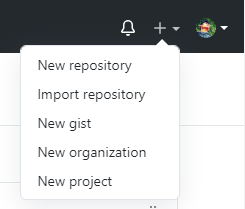
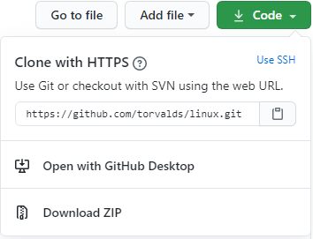

# Connecting To GitHub

Now that you know all the various functions and features of Git. And also why and how we use it. It is time you learn to use GitHub. 

You can use git locally with all the commands mentioned above, but if you want your project to be present on the cloud so that you can access it from anywhere or collaborate with others, you might want to add your repository to GitHub. 

### Preexisting Repository

To add your local git repository to the GitHub, follow the below steps : 



1. Head to [GitHub](https://github.com/).
2. Create an account or log into a pre-existing account.
3. Click on the [new repository](https://github.com/new) button present in the top right corner. Now, give your repository a name \(Project title\), A description, and select its visibility. You can also choose to initialize it with a [README](https://en.wikipedia.org/wiki/README) file. I would suggest you do so. You can also create a .gitignore file and add a [license](https://docs.github.com/en/github/creating-cloning-and-archiving-repositories/licensing-a-repository).
4. Once done, click on the "Create repository" button.
5. You now have a repository on the cloud. To connect your local repository to the one on GitHub, `cd/` to your local repository and type this in your terminal or bash.

```text
git remote add origin https://github.com/username/new_repo
git push -u origin master
```

Where username is your GitHub username.

### New Repository

If you don't have a local repository already and starting from scratch. Then, follow steps 1 to 4 from above. 

Once you have a repository on the cloud, open the repository, and code button with the download icon \(See screenshot\) and copy the link.



Now, just `cd/` to the folder you want the repository to be present in and use `git clone` followed by the link you copied earlier.

You should now have a local git repository that is already connected to GitHub. every time you commit and push changes, you can notice the changes on GitHub

