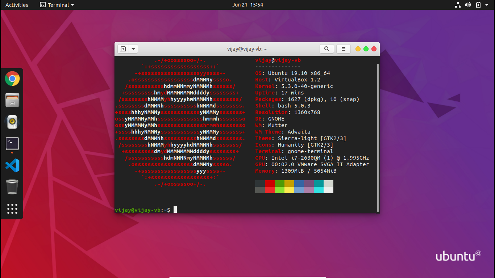

# Terminal Commands

The first question that pops into your mind would probably be, why learn these commands? 

The answer to that question is actually quite simple and straightforward.  **Terminal** is one of the most important applications on your computer. If you ever want to be a **coder** or work in a tech team as a developer, product manager, or any other tech role, you'll have a **big advantage** if you're already comfortable with **basic commands**. But anyone who uses a computer will benefit from becoming comfortable with this essential tool!

Listed below are the reasons why you should learn the command line :

* You gain a greater control over the system functions.
* You can use various package managers to install software.
* You can easily utilize the Git version control.
* You use it to compile code and to use pre-processors.
* You can also use it for local back-end development.

In the next few pages you are going to learn about various terminal commands and their functionalities.

