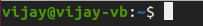

# Getting Started

## Launching

Before you start learning and using commands on your terminal, you must first know how to launch it.

There are two ways by which you can launch the terminal.

1. Just press the super key \(windows button\) on your keyboard and search for terminal.
2. You can also launch it by pressing `Ctrl + Alt + T`.

## Understanding the terminal

Once you launch the terminal, you can see something similar to what is shown below : 

1. The first part of the line is the name of the user \(vijay\).
2. The second part is the computer name or the host name.
3. The tilde '~' sign shows that the user in working in the **home directory**. If   you change the directory, this sign will vanish.  
4. The '$' sign suggests that you are working as a regular user in Linux. While working as a root user, '\#' is displayed.  

