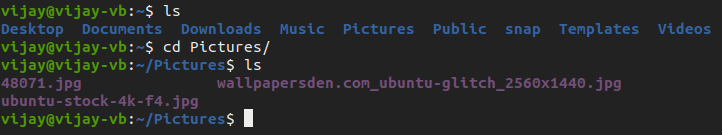
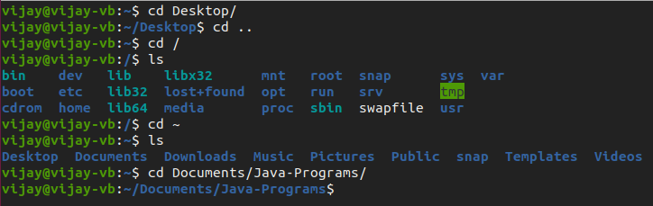
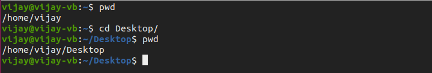

# Terminal File Manager

## Understanding Directories 

Before getting started, you must first know what a directory is. 

The term **directory** refers to the way a structured list of document files and **folders** is stored on the computer. On many computers, directories are known as folders.

Now that you know what a directory is, let us see how we can open/traverse through them on your terminal instead of using file explorer or the file manager\(GUI\).

## Terminal Commands

### Listing Files And Folders

The `ls` commands displays all the files and folders present in the current working directory.

### Changing Directories 

#### Moving into a directory

 If you want to change your current directory use the `cd directory_name`  command, where directory\_name is the directory you want to open.

#### Moving out of a directory

If you want to move up one directory, use `cd ..` . Note : On Linux, there has to be a **space** between `cd` and the two dots.

#### Navigating to the home directory

If you simply use only the `cd` or `cd ~` command, you will be back at your home directory.

#### Moving to root directory

The root of the file system in Linux is denoted by '/'. Similar to  'c:\' in Windows.

Note: In Windows, you use backward slash "\" while in UNIX/Linux, forward slash is used "/"

To move to the root directory, type `cd /` 

#### Navigating through multiple directories

You can navigate through multiple directories at the same time by specifying its complete path.

Example : `cd Desktop/folder_name`

### Present Working Directory 

The directory that you are currently browsing is called the present working directory. You log on to the home directory when you boot your PC. using the `pwd` command displays your current working directory.

